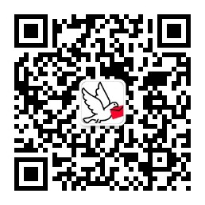

# homingpigeon-letter-wiki
homingpigeon-letter：信鸽相知，是一款以手写体为特色的信函系统，基于用户关系和手写体验，打造熟人深度社交工具应用。

熟人关系包括：个人、家庭、情侣、同学、师生等，让您的有温度、有态度、有情感的手写体文字传达真诚、热烈、深沉的情感，在平凡的生活中创造更多感动，让节日生活充满仪式感。

活动主题包括：日记随笔、恭贺新春、生日祝福和214情人节，更多主题活动敬请期待，微信小程序搜索【信鸽相知】，期待大家的体验使用！

[信鸽相知](https://mp.weixin.qq.com/s/4d2RCeT5SApUnkruE09Daw)

微信小程序二维码：

微信公众号二维码：

微信群二维码：

