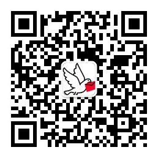

## 信鸽相知

### 简介

信鸽相知，是一款以手写体为特色的信函系统，基于用户关系和手写体验，打造熟人深度社交工具应用。
熟人关系包括：个人、家庭、情侣、同学、师生等，让您的有温度、有态度、有情感的手写体文字传达真诚、热烈、深沉的情感，在平凡的生活中创造更多感动，让节日生活充满仪式感。
活动主题包括：日记随笔、恭贺新春、生日祝福和214情人节，更多主题活动敬请期待，微信小程序搜索【信鸽相知】，期待大家的体验使用！

## 微信小程序

二维码：

### 关注微信公众号

二维码：

### 支持或联系微信群

二维码：

